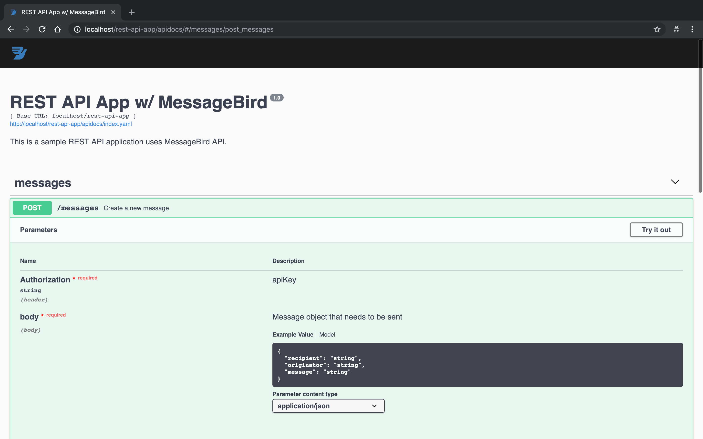

# REST API App w/ MessageBird

This is a sample REST API application uses MessageBird API. It allows you to make POST requests to send sms messages to anyone in the world. https://ebrukye.github.io/rest-api-app/

**Technologies used;**
- MessageBird API client SDK for PHP
- PHPUnit for testing
- Swagger UI for the documentation and sending requests
- Composer for the dependency management

## Installation
* Clone the repository to the directory that can be reached on your localhost.

`git clone https://github.com/ebrukye/rest-api-app.git`

* Install necessary packages to your workspace via Composer running command below.

`composer install`

* You can see **/apidocs** page to see the documentation and send requests.
http://localhost/rest-api-app/apidocs/



## Sending Requests
You can send requests using **Try it out** button on /apidocs page or send POST requests to the URL below using environments like **Postman.**

**Base URL:**
http://localhost/rest-api-app

**Reguest**

| Method | URL       | Header Key    | Header Value     |
| -------|-----------|---------------|----------------- |
| POST   | /messages | Content-Type  | application/json |
|        |           | Authorization | apiKey

Authorization header with a valid apiKey must be sent for authenticated requests. You can find sample data below.

**apiKey:** `rKNOfXdItLhfbGhcDFgYTDNFKitMDFZa`

**Sample Body**

```
{
    "recipient" : "31612345678",
    "originator": "MessageBird",
    "message": "This is a test message."
}
```

## Switching Between test/live Keys
MessageBird client is set up with test key as default. It allows you to see the response without actually sending the message. If you would like to have the message to be delivered, please set the key on **src/model/Base.php** as a valid live key you have been provided.

`const CLIENT_API_KEY = 'validLiveKey';`

## Running Tests
Run the command below in the root directory.

`./vendor/bin/phpunit tests --color`

OK (10 tests, 25 assertions)

## Improvements
* Slim framework can be used for more efficient structuring.
* API rate limit can be improved while storing requests using in-memory storage like Redis.
* JWT would be applied for more secure authentication.